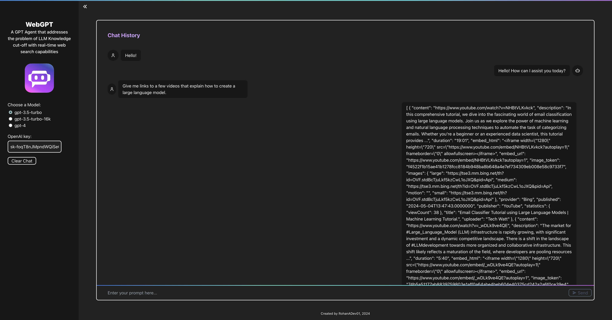
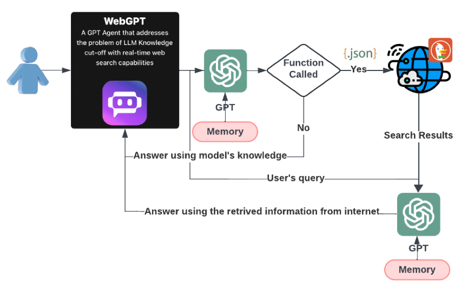

# WebGPT Agent with Real-Time Web Search Capabilities

## Project Overview
WebGPT is an advanced GPT agent that tackles the challenge of language model knowledge cut-off by integrating real-time web search capabilities. The project features both a frontend, developed using React, and a backend powered by Python.

## Features
**WebGPT** is a powerful tool enabling users to pose questions that require internet searches. Leveraging GPT Models it allows:
* **Real-Time Web Search:** The agent uses web search to provide up-to-date information, and identifies and executes the most relevant given Python functions in response to user queries.
* **Complex web search**: The web search supports diverse searches such as text, news, PDFs, images, videos, maps, and instant responses.
* **Overcoming knowledge-cutoff limitations**: The chatbot delivers answers based on the latest internet content.

## Application User Interface
<div align="center">
  
</div>

## Project Schema
<div align="center">
  
</div>

## Prerequisites
* **Node.js** (for frontend)
* **Python 3** (for backend)

## Frontend Setup
#### 1. Navigate to the Frontend Directory:
```
cd frontend
```

#### 2. Install Dependencies:
```
npm install
```

#### 3. Start the Frontend:
```
npm start
```

Runs the app in the development mode.\
Open [http://localhost:3000](http://localhost:3000) to view it in your browser.

The page will reload when you make changes.\
You may also see any lint errors in the console.

## Backend Setup
#### 1. Navigate to the Backend Directory:
```
cd backend
```

#### 2. Install Dependencies:
```
pip3 install -r requirements.txt
```

#### 3. Start the Backend:
```
python3 app.py
```

## Usage
1. **Open the Application:** Once the frontend and backend are running, open your browser and navigate to `http://localhost:3000`
2. **Select Model:** Use the sidebar to select the desired model for the agent.
3. **Start Interacting:** Type your queries and the agent will respond using both its built-in knowledge and real-time web search.
